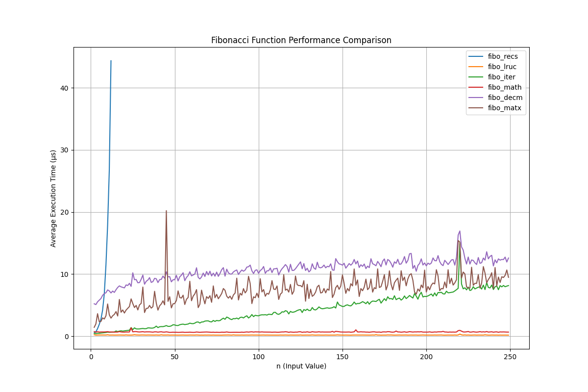

# Fibonacci Numbers Performance Analysis

## Abstract

This report contrasts multiple computational approaches for solving the $n$-th Fibonacci number in terms of execution time and precision, using Python 3.10. Performance evaluations include recursive methods with memoization, iterative solution, direct mathematical calculations via Binet’s formula, and matrix exponentiation. Memoization emerges as the most efficient and reliable approach, achieving near-constant execution time regardless of \(n\), with no loss in precision. While Binet’s formula initially outperforms iterative methods, it suffers from significant precision loss for large \(n\) due to floating-point limitations. Iterative methods, though slower than memoization, demonstrate predictable scaling, making them suitable for moderate-sized inputs. These findings highlight the trade-offs between performance and accuracy in Fibonacci computation methods.  

---

## Background

The Fibonacci sequence is a series of numbers where each term is the sum of the two preceding ones, starting from 0 and 1. The sequence progresses as follows:

$$ 0, 1, 1, 2, 3, 5, 8, 13, 21, 34, \dots $$

This simple pattern has fascinating connections to mathematics, biology, computer science, and art. Common methods to compute Fibonacci numbers include iterative and recursive approaches. While iterative methods are generally resource-efficient, recursion is often preferred for its simplicity. However, recursive approaches may be less efficient and prone to stack overflow due to repeated function calls.

### Binet’s Formula

[Binet's formula](https://en.wikipedia.org/wiki/Fibonacci_sequence#Closed-form_expression) provides an explicit solution for the \(n\)-th Fibonacci number:

$$ F(n) = \frac{\varphi^n - (1-\varphi)^n}{\sqrt{5}}, $$

where \(\varphi\) (the golden ratio) is approximately 1.618.

Although computationally direct, Python experiments revealed that this approach suffers from precision loss for large \(n\) due to floating-point limitations.

### Memoization

**Memoization** significantly optimizes recursive functions by caching results. In Python, the `@lru_cache` decorator from the `functools` module facilitates this, reducing redundant calculations.

To address floating-point inaccuracies, Python's `decimal` module was also tested to improve precision when using Binet’s formula.

---

## Methods

Several Fibonacci computation methods were implemented in Python:

- **Recursive** (`fibo_recs`): Optimized with `@lru_cache`.
- **Iterative** (`fibo_iter`): Iterative loop computation.
- **Binet's Formula**: Using both the `math` module (`fibo_math`) and the `decimal` module (`fibo_decm`) for higher precision.
- **Matrix Exponentiation** (`fibo_matx`): Leveraging matrix properties for efficient computation.

Performance was evaluated using a custom `timer` function, benchmarking execution time for \(n = 500\) over 1000 runs.

---

## Results

### Average Execution Times (n = 500)

| Method        | Execution Time (μs)     | Output Accuracy |
|---------------|-------------------------|-----------------|
| `fibo_recs`   | not tested              | not tested      |
| `fibo_lruc`   | 0.396                   | Accurate        |
| `fibo_iter`   | 18.591                  | Accurate        |
| `fibo_matx`   | 9.842                   | Accurate        |
| `fibo_math`   | 0.602                   | Precision Loss  |
| `fibo_decm`   | 16.171                  | Precision Loss  |

### Observations

1. **Memoized Recursion** (`fibo_recs`): Demonstrated consistently fast performance, with negligible execution time increases as \(n\) grew. This highlights the power of memoization.
2. **Iterative Approach** (`fibo_iter`): Performed efficiently, with execution time scaling linearly with \(n\).
3. **Matrix Exponentiation** (`fibo_matx`): Showed a moderate increase in execution time, scaling well for larger inputs.
4. **Binet's Formula** (`fibo_math` and `fibo_decm`): While direct calculation offers theoretical constant time complexity, precision issues emerged with `fibo_math` for large \(n\). Using `decimal` mitigated these errors but increased computation time.

---

## Visualization

### Performance Trends

#### Key Trends

- **Memoization Advantage**: The recursive method (`fibo_recs`) showed near-constant execution times, outperforming others.
- **Iterative Consistency**: Iterative computation scaled predictably, confirming its reliability for moderate-sized inputs.
- **Matrix Efficiency**: Matrix exponentiation exhibited an initial overhead but scaled efficiently for larger \(n\).
- **Precision Costs**: Using `Decimal` with Binet’s formula increased accuracy but introduced higher computation times.

#### Outliers

Performance spikes were observed for `fibo_matx` around \(n = 37\). These may be attributed to system-level factors such as garbage collection or memory allocation.

---

## Discussion

### Performance vs. Accuracy

- **Memoized Recursion**: The most efficient and reliable method for large Fibonacci numbers.
- **Iterative Method**: Offers simplicity and predictable scaling but is slightly slower than memoization.
- **Binet's Formula**: Suitable for small \(n\), but precision issues and floating-point overhead make it less viable for large inputs.
- **Matrix Exponentiation**: Provides a balance between performance and precision, with better scaling than iterative methods.
- **Precision Control**: The `decimal` module improves accuracy but incurs significant performance costs.

### Future Work

- Investigate system-level factors affecting outliers.
- Optimize matrix exponentiation further for high-performance applications.
- Explore hybrid approaches combining memoization and matrix properties.

---

## Conclusion

Memoization (`fibo_recs`) emerges as the optimal method for calculating Fibonacci numbers, combining speed and accuracy. Iterative methods and matrix exponentiation also perform well, with trade-offs depending on use cases. Further experimentation could refine these methods for specific applications.
